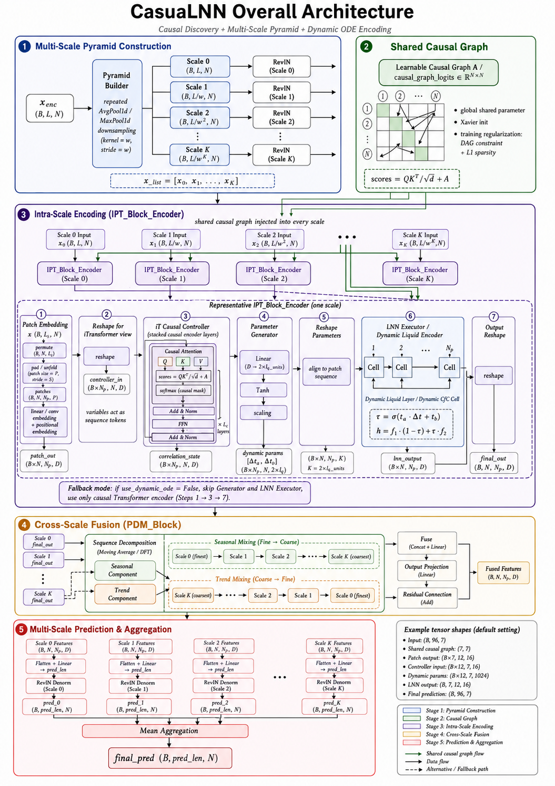

# CasuaLNN

[中文说明](README_zh.md)

CasuaLNN is an advanced time-series forecasting repository that focuses on Long-term and Short-term predictions, as well as Anomaly Detection and Imputation. It implements State-of-the-art models targeting real-world scenarios across domains such as Traffic, Weather, Energy, and more.

## Overview

This project unifies experiments for multiple widely-used benchmarks (ETTh1, ETTh2, ETTm1, ETTm2, Electricity, Traffic, Weather, PEMS03, PEMS08) under a single robust execution framework.

### Features
- **Unified Runner (`run.py`)**: All forecasting models and datasets share a single dynamic argument-driven entrance script, enabling clean iterations and ablation studies.
- **Batched Execution**: Full shell scripts configured to sweep standard prediction lengths (`96`, `192`, `336`, `720`).
- **State-of-The-Art Modules**: Integrated with advanced spatial-temporal components and embeddings.

## Model Architecture

<p align="center">
  
</p>
<p align="center">
  <i>The overall architecture of CasuaLNN, illustrating the data flow from input embedding through causal and temporal processing modules to the final prediction output.</i>
</p>

## Getting Started

### 1. Requirements

Install the dependencies:

```bash
pip install -r requirements.txt
```

### 2. Dataset Preparation

Datasets should be placed into either `./dataset/ETT`, `./dataset/electricity`, `./dataset/traffic`, `./dataset/weather`, or `./dataset/PEMS` respectively before running the scripts. 

### 3. Running Experiments

To reproduce all experiments, you can simply trigger the overarching shell script:

```bash
bash scripts/run.sh
```

Alternatively, you can run single tests by invoking `run.py` manually with your desired arguments. For example:

```bash
python -u run.py \
    --data ETTh1 \
    --root_path ./dataset/ETT/ \
    --data_path ETTh1.csv \
    --model_id ETTh1_96_96 \
    --pred_len 96 \
    --itr 1 \
    --decomp_method dft_decomp
```

## Abstract Architecture Parameters
Key configurable parameters within `run.py` include:
- `--model_id`: Experiment run unique identifier
- `--pred_len`: Prediction horizon
- `--seq_len`: Length of the input sequence
- `--label_len`: Start token length of the decoder
- `--d_model` / `--d_ff`: Dimension parameters for hidden states
- `--decomp_method`: Choices of numerical series decomposition patterns

## License
MIT License.
